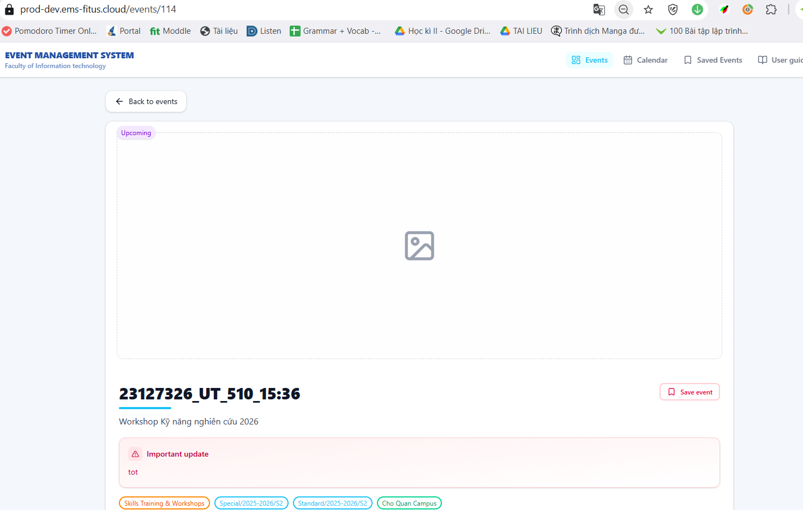
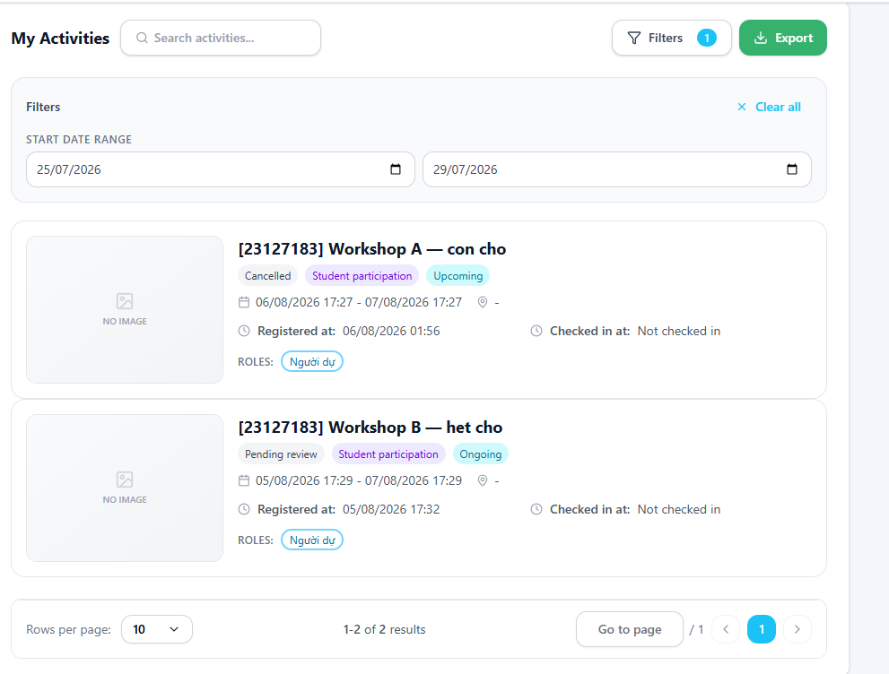
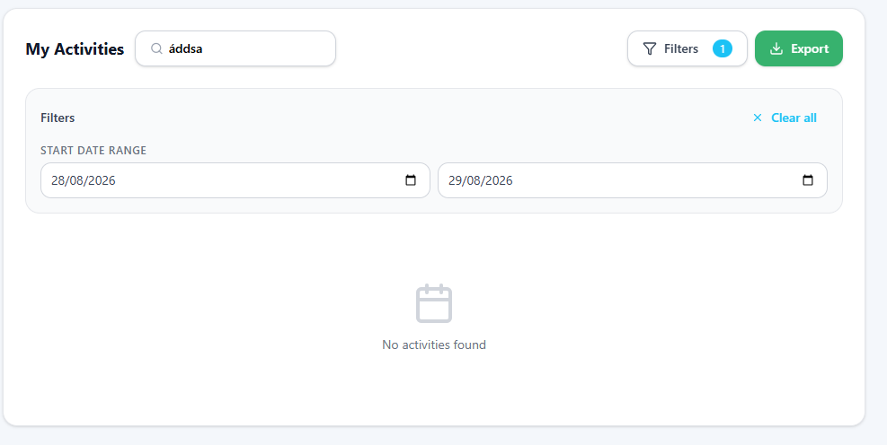
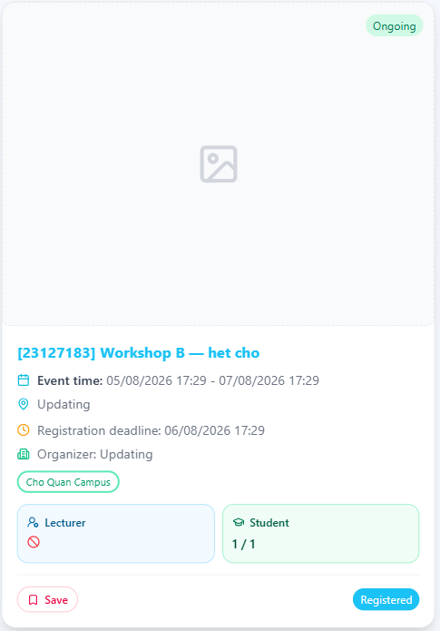

# Checklist Execution — Task 1B

**Sinh viên:** Phạm Vũ Ngọc Duy (23127183) · **Kịch bản:** B — User đăng ký tham dự sự kiện
**Checklist nguồn:** `team/gui-checklist.md` v1.1 — **61 item**
**Ngày chạy:** _(TODO)_ · **Môi trường chạy:** _(TODO: OS + browser + độ phân giải)_

> **Luật của đề:** mọi item phải được đánh **Passed** hoặc **Failed** cho **từng màn hình**. Cột **Notes** bắt buộc điền **lý do fail** với mỗi item Failed. Ảnh chụp **chỉ cần cho item Failed**.
> Ký hiệu: `P` Passed · `F` Failed · `N/A` không áp dụng (**phải ghi lý do ở Notes**, không được để trống) · *(trống)* = chưa chạy — **không được để trống khi nộp**.
> Màn hình: **S1 = B1** Danh sách sự kiện · **S2 = B2** Trang chi tiết sự kiện (gồm khối đăng ký) · **S3 = B4** My Profile — QR Code + My Activities.

---

## Trước khi chạy — 2 việc bắt buộc

1. **Đăng nhập** `23127183@student.hcmus.edu.vn`. Dữ liệu thử đã có sẵn (xem `docs/KHAO_SAT_EMS.md` mục 3): Workshop A (còn chỗ) · B (hết chỗ, có Waitlist) · C (đóng đăng ký) · D (đã kết thúc) · Public Event Test (bật công khai) · TEST validation.
2. **Đọc cột Notes trước khi tự tìm.** Với những item đã có 🔎, tôi đã tra cứu chéo với 27 finding trong `04-findings-log.md` và đợt khảo sát 05–06/08 — chỉ cần **xác nhận lại nhanh** (mở đúng màn hình, nhìn có đúng như mô tả không) thay vì điều tra lại từ đầu. Đây **chỉ là gợi ý tra cứu, không phải kết quả đã chốt** — bạn vẫn phải tự xác nhận Passed/Failed, không được copy thẳng.
   - `(?)` trước ID = tôi dự đoán N/A ở cả 3 màn vì widget đó chỉ có ở phía admin (Create Event, Dashboard) — dự đoán này *chưa chắc đúng*, tự xác nhận rồi mới điền N/A + lý do.

---

## Bảng tổng hợp

| Màn hình | Tổng item | Passed | Failed | N/A | Tỉ lệ pass |
|---|:--:|:--:|:--:|:--:|:--:|
| S1 — B1 Danh sách sự kiện | 61 | 22 | 11 | 28 | 66.7% (22/33) |
| S2 — B2 Trang chi tiết sự kiện | 61 | 22 | 16 | 23 | 57.9% (22/38) |
| S3 — B4 My Profile — QR Code + My Activities | 61 | 25 | 11 | 25 | 69.4% (25/36) |
| **Tổng** | **61×3=183** | **69** | **38** | **76** | **64.5% (69/107)** |

> Tỉ lệ pass tính trên `Passed / (Passed + Failed)`, **không tính N/A vào mẫu số** — đúng quy ước ở `team/gui-checklist.md`.

---

## Bảng chạy hợp nhất

| ID | Item (rút gọn) | IA | S1 | S2 | S3 | Notes | Bug-ID | Ảnh |
|---|---|:--:|:--:|:--:|:--:|---|---|---|
| G-01 | Căn lề & khoảng cách nhất quán giữa các khối | IA-01 | Passed | Passed | Passed | Các khối căn lề đều, khoảng cách nhất quán ở cả 3 màn | | |
| G-02 | Font tối đa 2 họ; cỡ chữ phân cấp nhất quán | IA-01 | Passed | Passed | Passed | Font và phân cấp cỡ chữ nhất quán giữa các trang | | |
| G-03 | Màu đúng ngữ nghĩa; đỏ chỉ dành cho lỗi/phá huỷ | IA-01 | Failed | Failed | Passed | S1 = nút **`Save`** (bookmark sự kiện, hành động trung tính) dùng viền **đỏ**, cùng tông với các cảnh báo lỗi và nút phá huỷ (`Cancel registration`). ⚠️ Tôi soi lại `G-06-S2.png` đã có sẵn — nút **`Save event`** trên S2 cũng viền đỏ y hệt, nên tự thêm S2 = Failed dù bạn chỉ báo S1; bạn xác nhận lại giúp nếu thấy khác. S3 = không thấy vấn đề này | S1/S2: `CL-B1-04` | [G-06-S2.png](evidence/task1b/G-06-S2.png) |
| G-04 | Không có thanh cuộn ngang ngoài ý muốn ≥1280px | IA-01 | Passed | Passed | Passed | Không thấy thanh cuộn ngang ở cả 3 màn tại ≥1280px | | |
| G-05 | Ảnh giữ đúng tỉ lệ khung, không méo/cắt mất nội dung | IA-01 | Passed | Passed | Passed | Ảnh tải được (không tính các trường hợp lỗi đã ghi ở `G-06`) hiển thị rõ nét, không mờ/méo | | |
| G-06 | Ảnh lỗi có khối giữ chỗ có ý nghĩa, không ô xám trơn | IA-01 | Failed | Failed | Passed | S1 = `SV-B1-04` (ô xám trơn, không chữ) S2 = quan sát mới trên banner sự kiện `23127326_UT_510_15:36` — chỉ có icon ảnh chung chung, không nhãn chữ S3 = thẻ My Activities hiện icon **kèm chữ "NO IMAGE"** — có nhãn, đạt tiêu chí | S1: `SV-B1-04` S2: `CL-B2-01` | S1: [KS_B1_the-su-kien.png](evidence/survey/KS_B1_the-su-kien.png) S2: [G-06-S2.png](evidence/task1b/G-06-S2.png) |
| G-07 | Empty state nêu lý do + gợi ý hành động tiếp theo | IA-01 | Passed | N/A | Failed | S1 = **sửa lại `SV-B1-02`**: đã có câu lý do ("There are no events matching your filters") + icon xoá bộ lọc cạnh `Filters 3` — bấm thử xác nhận đúng là xoá hết bộ lọc. Kết luận cũ của tôi (khảo sát 05/08) đọc sót cả hai chi tiết này, đã sửa `SV-B1-02` thành severity 0. S2 = không có tính năng filter trên trang chi tiết sự kiện — N/A hợp lý. S3 = ép ra được trạng thái rỗng thật bằng Search từ khoá vô nghĩa (`G-07-S3-2.png`) — chỉ ghi "No activities found", **không nêu lý do** (không nói do search hay do filter ngày), yếu hơn hẳn bản của S1. Ghi nhận là `CL-B4-02` | S1: `= SV-B1-02` (đã sửa) S3: `CL-B4-02` | S1: [G-07-S1.png](evidence/task1b/G-07-S1.png) S3: [G-07-S3-2.png](evidence/task1b/G-07-S3-2.png) |
| G-08 | Loading có skeleton/spinner, bố cục không nhảy khi data về | IA-01 | Passed | Passed | Passed | S2 (Slow 3G) = có spinner rõ ràng giữa trang trắng trong lúc tải (`G-08-S2.png`), không phải skeleton nhưng vẫn thoả "có skeleton **hoặc** spinner". S1/S3 cùng kiểu loading | | [G-08-S2.png](evidence/task1b/G-08-S2.png) |
| G-09 | Giá trị rỗng dùng cùng 1 ký hiệu thống nhất | IA-01 | Failed | Passed | Passed | Workshop B: S1 hiện `Location: Updating` + `Organizer: Updating`, nhưng S2 và S3 cùng sự kiện lại hiện `-`. S2/S3 tự thân Passed (đúng quy ước `-`), nhưng S1 lệch — coi cả nhóm là Failed vì đề bài đòi "cùng 1 ký hiệu trên MỌI màn" | S1: `CL-B1-01` | S1: [G-09-S1.png](evidence/task1b/G-09-S1.png) S2: [G-09-S2.png](evidence/task1b/G-09-S2.png) S3: [G-09-S3.png](evidence/task1b/G-09-S3.png) |
| G-10 | Nhãn dùng ngôn ngữ người dùng, không phơi mã định danh nội bộ | IA-01 | Failed | Failed | Failed | S1/S2 = `SV-B1-03` — trường Title chứa chuỗi mã. S3 = **còn nặng hơn**: thẻ My Activities cho sự kiện `23127326_UT_215_1609` chỉ hiện chuỗi mã, **không có dòng Description phụ nào cả** — không có cách nào biết tên thật sự kiện là gì | S1/S2/S3: `= SV-B1-03` | S1/S2: [KS_B2_su-kien-nguoi-khac.png](evidence/survey/KS_B2_su-kien-nguoi-khac.png) S3: [G-10-S3.png](evidence/task1b/G-10-S3.png) |
| G-11 | EN/VI dịch toàn bộ text kể cả toast/tooltip/lỗi | IA-01 | Failed | Failed | Failed | Chuông thông báo (có mặt trên header mọi trang) hiện tiếng Việt "Đăng ký sự kiện được phê duyệt" dù giao diện đang EN | S1/S2/S3: `= SV-NOTIF-01` | [KS_NOTIF_approved.png](evidence/survey/KS_NOTIF_approved.png) |
| G-12 | Dữ liệu hiển thị (tên vai trò...) theo đúng ngôn ngữ đang chọn | IA-01 | Passed | Failed | Failed | S1: không thấy dữ liệu tiếng Việt lẫn vào (tag, role label đều EN). S2/S3: role "Sinh viên" hiện tiếng Việt trong UI tiếng Anh — mở rộng `SV-B2-02` sang cả S3 (badge ROLES ở My Activities cũng lỗi này) | S2/S3: `= SV-B2-02` | S2: [G-12-S2.png](evidence/task1b/G-12-S2.png) S3: [G-12-S3.png](evidence/task1b/G-12-S3.png) |
| G-13 | Ngôn ngữ đã chọn được lưu, giữ nguyên sau reload | IA-01 | Passed | Passed | Passed | Đổi ngôn ngữ, F5, điều hướng qua lại cả 3 màn — giữ nguyên | | |
| G-14 | Tương phản chữ/nền ≥4.5:1 thường, ≥3:1 chữ lớn | IA-01 | Passed | Passed | Passed | Kiểm bằng DevTools color picker ở nhiều vị trí chữ, không thấy chỗ nào dưới ngưỡng AA | | |
| G-15 | Đọc được, không vỡ bố cục khi zoom 200% | IA-01 | Passed | Passed | Passed | Zoom 200% cả 3 màn, không thấy chữ cắt/nút vỡ | | |
| G-16 | Text VI dài hơn không vỡ nút/cắt chữ/gãy từ | IA-01 | Passed | Passed | Passed | Chữ tiếng Việt dài không làm vỡ nút/layout ở cả 3 màn | | |
| F-01 | Mọi trường có nhãn hiển thị thường trực, không chỉ placeholder | IA-02 | Passed | N/A | Passed | S1 = ô Search, các trường Filters (Event Date, Campus...) đều có nhãn thường trực. S2 = N/A, khối đăng ký chỉ có checkbox, không có ô nhập cần nhãn kiểu này. S3 = ô Search activities, Filters đều có nhãn | | |
| F-02 | Trường bắt buộc đánh dấu nhất quán (vd `*`), có chú giải | IA-02 | N/A | N/A | N/A | Không có trường nào trong Filters/Search được đánh dấu bắt buộc — bản thân các trường lọc đều tự do, không có form bắt buộc điền ở B1/B2/B4 | | |
| F-03 | Lỗi hiện ngay cạnh trường, trong tầm nhìn, không chỉ toast | IA-02 | N/A | N/A | N/A | Không có form nào có thể tạo lỗi validate ở B1/B2/B4 (chỉ có Filters/Search, không bắt buộc, không có khái niệm "lỗi trường") | | |
| F-04 | Thông báo lỗi nói rõ cách khắc phục | IA-02 | N/A | N/A | N/A | Cùng lý do F-03 — không có thông báo lỗi trường nào để chấm | | |
| F-05 | Validate fail vẫn giữ nguyên dữ liệu đã nhập | IA-02 | N/A | N/A | N/A | Cùng lý do F-03 | | |
| F-06 | Ràng buộc chặn ngay tại chỗ nhập, không chỉ sau submit | IA-02 | N/A | N/A | N/A | Không có ràng buộc nhập liệu nào ở B1/B2/B4 (Filters không bắt buộc hợp lệ) | | |
| F-07 | Nút submit khoá khi form chưa hợp lệ; bấm đúp không tạo trùng | IA-02 | N/A | Passed | N/A | S1/S3 = N/A, không có submit form kiểu này. S2 = nút `Register` mờ/khoá khi chưa tick vai trò, bấm đúp sau khi hợp lệ không tạo 2 đăng ký trùng | | |
| F-08 | Upload kiểm định dạng/dung lượng, báo giới hạn trước | IA-02 | N/A | N/A | N/A | Xác nhận: không có ô upload nào ở B1/B2/B4 | | |
| F-09 | Upload có preview đúng tỉ lệ trước khi lưu | IA-02 | N/A | N/A | N/A | Cùng lý do F-08 | | |
| F-10 | Rich-text có đủ nút định dạng, dán không vỡ bố cục | IA-02 | N/A | N/A | N/A | Xác nhận: không có rich-text editor ở B1/B2/B4 | | |
| F-11 | Hành động không hoàn tác có bước xác nhận/tóm tắt trước khi gửi | IA-02 | N/A | Passed | N/A | S1/S3 = N/A, không có hành động không hoàn tác nào ở đây (danh sách + xem hồ sơ). S2 = CÓ hộp thoại xác nhận (`KS_B2_cancel-02_dialog.png`) — thoả tiêu chí "có bước xác nhận"; nội dung dialog kém là chuyện khác, tính riêng ở `S-03` | | [KS_B2_cancel-02_dialog.png](evidence/survey/KS_B2_cancel-02_dialog.png) |
| F-12 | Lựa chọn bị khoá nêu rõ lý do + lựa chọn thay thế | IA-02 | N/A | Failed | N/A | S1/S3 = N/A, không có "lựa chọn bị khoá" nào ở các màn này. S2 = `SV-B2-01` — "Role is full", không mời vào waitlist dù ô đếm Waitlisted tồn tại | S2: `= SV-B2-01` | [KS_B2_workshop-b-het-cho.png](evidence/survey/KS_B2_workshop-b-het-cho.png) |
| F-13 | Ô nhập có focus nhìn thấy được; Tab đi đúng thứ tự | IA-02 | N/A | Passed | Passed | S1 = N/A, không có modal/form focus riêng để test rõ ràng (Filters là panel mở rộng, không phải modal). S2 = Tab nhảy tuần tự đúng qua checkbox vai trò → nút Register. S3 = modal QR có nút Download + nút đóng `×`, thao tác được | | |
| F-14 | Form/modal đóng bằng Esc, cảnh báo nếu còn dữ liệu chưa lưu | IA-02 | N/A | Passed | Passed | S1 = N/A, cùng lý do F-13. S2 = Esc đóng được dialog Cancel registration. S3 = Esc đóng được modal QR Code | | [check-in-profile.png](evidence/survey/check-in-profile.png) |
| F-15 | Upload nêu rõ giới hạn dung lượng/số lượng file | IA-02 | N/A | N/A | N/A | Xác nhận: khớp `SV-ADM-01` nhưng đó là màn admin, không áp dụng ở đây | | |
| F-16 | Cặp trường thời gian phụ thuộc nhau chặn cấu hình vô lý | IA-02 | N/A | N/A | N/A | Xác nhận: khớp `SV-ADM-03/04/05` nhưng đó là màn admin, không áp dụng ở đây | | |
| N-01 | Menu chính nhất quán mọi trang, mục đang xem nổi bật | IA-03 | Passed | Passed | Failed | S1/S2 = mục `Events`/`Sự kiện` trên menu được tô nổi khi đứng ở B1 hoặc mở một sự kiện. S3 = **không có mục nào trên menu chính được tô nổi** khi đứng ở My Profile (`N-01-S3.png`) — vì bản thân menu chính (Events/Calendar/Saved Events/User guide) **không có mục nào đại diện cho Profile** để mà tô sáng | S3: `CL-B4-03` | [N-01-S3.png](evidence/task1b/N-01-S3.png) |
| N-02 | Trang chi tiết có đường quay lại danh sách (không chỉ dựa Back) | IA-03 | N/A | Passed | N/A | S1/S3 = N/A, không phải trang chi tiết nên không có khái niệm "quay lại danh sách". S2 = ✅ **sửa lại 06/08 — kết luận trước sai.** Nút `Back to events` CÓ tồn tại ở đầu trang B2 khi đã đăng nhập (`G-06-S2.png`). Đã sửa `SV-B2-03` thành severity 0 | | [G-06-S2.png](evidence/task1b/G-06-S2.png) |
| N-03 | Back trình duyệt giữ nguyên bộ lọc/trang/vị trí cuộn | IA-03 | Failed | N/A | Failed | S1 = Failed cả 2 phần: bấm Back đưa về đầu trang mặc định, vị trí cuộn cũng không giữ (`CL-B1-02`). S2 = N/A, không có filter/phân trang trên trang chi tiết. S3 = Failed cùng nguyên nhân với `CL-B1-03` — bộ lọc trên My Activities cũng mất khi bấm Back, vì state chưa từng nằm trong URL để khôi phục | S1: `CL-B1-02` S3: `CL-B1-03` | [N-06-S1-before.png](evidence/task1b/N-06-S1-before.png) · [N-06-S1-after.png](evidence/task1b/N-06-S1-after.png) |
| N-04 | Sau đăng nhập quay lại đúng trang vừa yêu cầu, không về home | IA-03 | N/A | Failed | N/A | S1/S3 = N/A, không có luồng "bị chặn đăng nhập rồi redirect" được test ở đây. S2 = đăng nhập xong **bị đẩy về trang chủ**, không quay lại đúng sự kiện vừa yêu cầu | S2: `CL-B2-03` | |
| N-05 | URL phản ánh trạng thái (tab/lọc/trang) để share/reload đúng | IA-03 | Failed | N/A | Failed | S1 = áp 4 filter, URL vẫn đứng yên `/dashboard`, không đổi. S2 = N/A, không có trạng thái lọc/tab trên trang chi tiết. S3 = áp filter ngày, URL vẫn đứng yên `/profile` | S1/S3: `CL-B1-03` | S1: [N-05-S1.png](evidence/task1b/N-05-S1.png) S3: [N-05-S3.png](evidence/task1b/N-05-S3.png) |
| N-06 | Đổi tab/lọc tải đúng dữ liệu, giữ trạng thái khi quay lại | IA-03 | Failed | N/A | Failed | S1 = bộ lọc bị mất khi bấm Back từ trang chi tiết quay lại (`CL-B1-02`). S2 = N/A, không có tab/filter trên trang chi tiết. S3 = `CL-B4-01` — lọc `Start Date Range` không thu hẹp kết quả | S1: `CL-B1-02` S3: `CL-B4-01` | S1: [N-06-S1-before.png](evidence/task1b/N-06-S1-before.png) · [N-06-S1-after.png](evidence/task1b/N-06-S1-after.png) S3: [G-07-S3.png](evidence/task1b/G-07-S3.png) |
| N-07 | Sidebar thu/mở được, không che nội dung chính | IA-03 | N/A | N/A | N/A | Xác nhận: phía student dùng header, không có sidebar | | |
| N-08 | Kéo-thả có tay cầm rõ, phản hồi thị giác, lưu đúng thứ tự | IA-03 | N/A | N/A | N/A | Xác nhận: không có danh sách kéo-thả ở B1/B2/B4 | | |
| N-09 | Không có liên kết hỏng, không rơi 404 | IA-03 | Passed | Passed | Passed | Bấm thử Calendar, Saved Events, User guide, share icon (S1); avatar, Edit Profile, Change Password (S3); nav header (chung cho S2) — không có liên kết nào hỏng | | |
| N-10 | Chức năng cần ngay sau thao tác nằm trong tầm với ngữ cảnh đó | IA-03 | Passed | Failed | Passed | S1 = không có "chức năng cần ngay sau" nào bị thiếu ở đây. S2 = sau khi đăng ký xong, không có đường dẫn nào tới QR/xác nhận — `SV-B2-09` + `SV-B4-01`. S3 = QR nằm ngay trong tầm với một khi đã ở đúng trang Profile | S2: `= SV-B2-09` | [KS_B3_05_sau-submit.png](evidence/survey/KS_B3_05_sau-submit.png) |
| N-11 | Danh sách dài có phân trang rõ ràng, dùng chung 1 kiểu | IA-03 | Passed | N/A | Passed | S1 = phân trang B1 cùng kiểu điều khiển với S3. S2 = N/A, trang chi tiết không có danh sách dài. S3 = đủ 4 điều khiển rõ ràng (`Rows per page` · `1-2 of 2 results` · `Go to page` · `‹ 1 ›`) | | [G-07-S3-2.png](evidence/task1b/G-07-S3-2.png) |
| N-12 | Có đường vào tài liệu hướng dẫn, nội dung khớp giao diện đang chạy | IA-03 | Failed | Failed | Failed | `User guide` có trên header mọi trang nhưng chỉ có tiếng Việt dù UI đang EN, và không nói QR nằm ở đâu | S1/S2/S3: `= SV-UG-01` | [KS_UG_01.png](evidence/survey/KS_UG_01.png) |
| S-01 | Hành động thay đổi dữ liệu có phản hồi tức thì, vị trí nhất quán | IA-04 | Passed | Failed | Passed | S1/S3 = các hành động khác (Save event, Cancel registration, Filters) có phản hồi tức thì bình thường. S2 = `SV-B2-09` — đăng ký xong không toast, không thông báo | S2: `= SV-B2-09` | [KS_B3_05_sau-submit.png](evidence/survey/KS_B3_05_sau-submit.png) |
| S-02 | Toast phân biệt cả màu lẫn icon/chữ, đủ lâu để đọc | IA-04 | N/A | N/A | N/A | **Xác nhận: hệ thống không dùng toast ở bất kỳ đâu.** Rà lại toàn bộ 61 dòng đã chạy — không nơi nào có thông báo bật lên tạm thời rồi tự tắt; hệ thống chỉ dùng badge/banner thường trực (khớp với `SV-B2-09`: đăng ký xong không có toast). Không có toast nào tồn tại để chấm màu/icon/thời lượng | | |
| S-03 | Hành động không hoàn tác có dialog nêu rõ hậu quả | IA-04 | N/A | Failed | N/A | S1/S3 = N/A, không có hành động không hoàn tác nào ở đây. S2 = `SV-B2-07` — dialog Cancel chỉ hỏi "are you sure", không nêu hậu quả | S2: `= SV-B2-07` | [KS_B2_cancel-02_dialog.png](evidence/survey/KS_B2_cancel-02_dialog.png) |
| S-04 | Badge trạng thái có cả màu lẫn nhãn chữ, nhất quán mọi màn | IA-04 | Passed | Passed | Passed | Quan sát nhất quán qua nhiều ảnh: Upcoming/Ended/Pending (B1, B2) và Pending review/Ongoing (B4) đều có cả màu lẫn chữ, không màn nào chỉ dùng màu trơn | | [KS_B2_workshop-b-het-cho.png](evidence/survey/KS_B2_workshop-b-het-cho.png) |
| S-05 | Khối đổi màu theo trạng thái phải kèm nhãn chữ giải thích | IA-04 | Passed | Passed | Passed | S1/S3 = các khối số liệu (Slot, Registered...) đều có nhãn chữ đi kèm. S2 = khối `Slot available` đổi màu (xanh→hồng) LUÔN kèm nhãn chữ "Slot available" + số cụ thể ("Student: 0"), không chỉ đổi màu trơn | | [G-09-S2.png](evidence/task1b/G-09-S2.png) |
| S-06 | Khối chức năng giữ nguyên số ô giữa các bản ghi cùng loại | IA-04 | N/A | Failed | N/A | S1/S3 = N/A, không có khối nhiều ô số liệu kiểu Registration roles ở đây. S2 = `SV-B2-04` — Workshop B có 4 ô, Workshop C chỉ 3 ô (thiếu Waitlisted). Xác nhận thêm ở sự kiện CV Workshop (`G-12-S2.png`) cũng chỉ có 3 ô | S2: `= SV-B2-04` | [KS_B2_workshop-b-het-cho.png](evidence/survey/KS_B2_workshop-b-het-cho.png) |
| S-07 | Nội dung nổi bật trang chủ chỉ hiện bản ghi còn hiệu lực | IA-04 | Failed | N/A | N/A | S1 = `SV-B1-01` — carousel SPOTLIGHT EVENT hiện sự kiện đã `Ended`. S2/S3 = N/A, không có carousel nổi bật ở các màn này | S1: `= SV-B1-01` | [KS_B1_trang-chu-carousel.png](evidence/survey/KS_B1_trang-chu-carousel.png) |
| S-08 | Tác vụ chạy lâu có progress/spinner kèm chỉ báo bước/thời gian | IA-04 | N/A | N/A | N/A | S1/S2 = N/A, không có tác vụ chạy lâu nào ở các màn này. S3 = N/A — Export chạy quá nhanh để tính là "tác vụ chạy lâu". ⚠️ Ghi chú phụ (không phải lỗi): bấm Export chuyển sang trang mới rồi mới hiện file tải về, hơi khác kiểu tải trực tiếp thường thấy — nếu muốn soi kỹ có thể kiểm lại ở Task 3 | | |
| S-09 | Ngày giờ 1 định dạng thống nhất, nêu múi giờ ở hạn chót | IA-04 | Failed | Failed | Failed | Định dạng thống nhất (đạt), nhưng **không có múi giờ ở bất kỳ đâu** (đã xác nhận) — thiếu nửa sau của tiêu chí nên tính Failed cả 3 màn | S1/S2/S3: `CL-B2-02` | |
| S-10 | Bộ đếm/nhãn trạng thái thời gian khớp dữ liệu ngày giờ cạnh nó | IA-04 | Passed | Passed | Passed | Badge trạng thái (Upcoming/Ongoing/Ended...) khớp đúng khoảng ngày giờ hiển thị cạnh nó ở cả 3 màn | | |
| S-11 | Mất mạng báo rõ, cho biết thao tác vừa rồi có lưu không | IA-04 | N/A | Failed | Failed | S1 = N/A, không có thao tác ghi dữ liệu nào ở trang danh sách để cần báo trạng thái lưu. S2 = bấm Register khi offline, spinner hiện rồi treo vô thời hạn, không báo gì. S3 = Export thất bại im lặng; Filters cũng spinner treo như S2 | S2/S3: `CL-B4-04` | |
| S-12 | QR/barcode đủ lớn, sắc nét, không co méo màn hình nhỏ | IA-04 | N/A | N/A | Passed | S1/S2 = N/A, QR chỉ ở B4. S3 = **đã kiểm thật bằng camera điện thoại — quét được**, ảnh QR đủ nét | | |
| S-13 | Nhãn nút/tiêu đề dùng cùng 1 quy ước viết hoa toàn hệ thống | IA-04 | Passed | Passed | Passed | Rà các nút chính (Save event, Register, Cancel registration, Export, Filters, Sign In...) — ngoài `SV-B2-05` (nút `login` ở màn chặn chưa đăng nhập) không thấy thêm bất thường nào | | |
| S-14 | Sau khi hoàn tất thao tác, hệ thống chỉ đường bước tiếp theo | IA-04 | N/A | Failed | N/A | S1/S3 = N/A, không có "thao tác vừa hoàn tất" cần chỉ đường ở các màn này. S2 = `SV-B2-09` — đăng ký xong không chỉ dẫn gì tiếp theo | S2: `= SV-B2-09` | [KS_B3_05_sau-submit.png](evidence/survey/KS_B3_05_sau-submit.png) |
| S-15 | Một khái niệm trạng thái dùng 1 bộ từ vựng duy nhất | IA-04 | N/A | Failed | Passed | **Đã xem lại kỹ theo yêu cầu của bạn — kết luận khác với hint ban đầu.** S1 = N/A, trang danh sách không hiển thị trạng thái đăng ký cá nhân. S2 = Failed: **tự mâu thuẫn với chính nó** — badge tiêu đề khối ghi `Pending review` nhưng 4 ô đếm ngay bên dưới ghi `Pending` (khác chữ), và `Pending` cũng không khớp tài liệu chính thức (`Pending Review`). S3 = Passed: badge trên thẻ My Activities ghi `Pending review`, khớp gần đúng tài liệu — ⚠️ mới xác nhận được trạng thái Pending, chưa thấy badge Approved/Rejected/Waitlisted trên B4 để so hết | S2: `= SV-B4-03` (đã viết lại) | [G-12-S2.png](evidence/task1b/G-12-S2.png) |
| S-16 | Chỉ số dashboard khớp dữ liệu thật, không hiện 0 sai | IA-04 | N/A | N/A | N/A | Xác nhận: khớp `SV-ADM-02` nhưng đó là màn admin, không áp dụng ở đây | | |
| S-17 | Thông tin ra quyết định (chỗ còn lại, hạn) hiện ngay tại chỗ quyết định | IA-04 | Passed | Passed | N/A | S1 = thẻ sự kiện hiện sẵn `Registration deadline` + số chỗ (`G-09-S1.png`). S2 = khối đăng ký hiện `Slot available` + `Registration period` ngay tại chỗ bấm Register (`G-09-S2.png`). S3 = N/A hợp lý — đã đăng ký rồi, không còn quyết định "có nên đăng ký" để ra nữa | | S1: [G-09-S1.png](evidence/task1b/G-09-S1.png) S2: [G-09-S2.png](evidence/task1b/G-09-S2.png) |

> **Đếm nhanh:** G 16 · F 16 · N 12 · S 17 = **61 dòng**, khớp `team/gui-checklist.md`. Đếm lại bằng `grep -cE "^\| (\(\?\) )?[GFNS]-" 01-checklist-execution.md` trước khi nộp.

---

## Chi tiết các item Failed

Mỗi item Failed → 1 block. Đây là nguồn trực tiếp để tạo bug entry trong `04-findings-log.md`. Với item đã trùng một finding `SV-` có sẵn — **không tạo Bug-ID `CL-` mới**, ghi thẳng `= SV-xxx` ở Notes của bảng trên và **không submit Google Form lần hai** (xem cảnh báo chống đếm trùng ở `04-findings-log.md`).

### [F-01] `G-06` — Ảnh lỗi không có khối giữ chỗ có ý nghĩa — Màn hình: S2 (B2)

- **Kết quả:** ❌ Failed
- **Kỳ vọng (theo item checklist):** Ảnh không tải được phải hiện khối giữ chỗ có ý nghĩa (tên viết tắt, icon kèm nhãn chữ), không để ô xám trơn/icon chung chung không giải thích.
- **Thực tế quan sát:** Banner đầu trang chi tiết sự kiện `23127326_UT_510_15:36` (sự kiện của sinh viên khác, không có ảnh upload) chỉ hiện một icon hình ảnh generic ở giữa khung viền nét đứt, không có chữ giải thích nào đi kèm.
- **Các bước tái hiện:**
  1. Mở `https://prod-dev.ems-fitus.cloud/events/114`
  2. Nhìn banner ngay dưới nút `Back to events`
- **Heuristic bị vi phạm:** N1 (visibility of system status) · N8 (aesthetic and minimalist — nhưng thiếu thông tin cần thiết)
- **Severity:** 1 — cùng mức với `SV-B1-04`, chỉ ảnh hưởng thẩm mỹ/rõ ràng, không chặn tác vụ
- **Bug-ID trong log:** `CL-B2-01`
- **Ảnh:** `evidence/task1b/G-06-S2.png`

> Ghi chú thêm: ảnh này cũng tái xác nhận `SV-B1-03` — tiêu đề chính vẫn là chuỗi mã máy `23127326_UT_510_15:36`, tên thật `Workshop Kỹ năng nghiên cứu 2026` bị đẩy xuống dòng phụ. Không tạo entry riêng vì đã trùng `SV-B1-03`.

### [F-02] `N-06` (đối chiếu chéo với `G-07`) — Bộ lọc `Start Date Range` không lọc dữ liệu thật — Màn hình: S3 (B4)

- **Kết quả:** ❌ Failed
- **Kỳ vọng (theo item checklist):** Đổi bộ lọc phải tải đúng dữ liệu tương ứng với điều kiện đã chọn.
- **Thực tế quan sát:** Đặt `Start Date Range` = `25/07/2026` → `29/07/2026` trên khối Filters của My Activities. Danh sách vẫn hiện đủ 2 thẻ hoạt động (`Workshop A` ngày sự kiện `06/08/2026`, `Workshop B` ngày sự kiện `05/08/2026`) — cả hai đều nằm **hoàn toàn ngoài** khoảng đã lọc. Bộ lọc không thu hẹp kết quả chút nào.
- **Các bước tái hiện:**
  1. Đăng nhập, vào My Profile → tab My Activities
  2. Bấm `Filters`
  3. Nhập `Start Date Range` = `25/07/2026` đến `29/07/2026`
  4. Quan sát danh sách bên dưới — vẫn hiện đủ các thẻ không khớp khoảng ngày
- **Heuristic bị vi phạm:** N1 (visibility of system status — kết quả không phản ánh đúng điều kiện lọc) · N4 (consistency)
- **Severity:** 3 (đề xuất) — người dùng không thể tin vào kết quả lọc, nhưng không chặn hẳn tác vụ chính (vẫn xem được toàn bộ My Activities). **Bạn tự duyệt lại severity này.**
- **Bug-ID trong log:** `CL-B4-01`
- **Ảnh:** `evidence/task1b/G-07-S3.png`

> Hệ quả phụ: vì bộ lọc không bao giờ trả về 0 kết quả, không thể quan sát được trạng thái rỗng thật ở S3 để chấm `G-07`. Xem ghi chú ở dòng `G-07` trong bảng — cần thử lại bằng ô Search với từ khoá vô nghĩa để ép ra empty state thật.

### [F-03] `G-07` — Trạng thái rỗng ở B4 không nêu lý do — Màn hình: S3 (B4)

- **Kết quả:** ❌ Failed
- **Kỳ vọng (theo item checklist):** Trạng thái rỗng nêu lý do vì sao rỗng và gợi ý hành động tiếp theo.
- **Thực tế quan sát:** Search với từ khoá vô nghĩa (`áddsa`) ra 0 kết quả. Trạng thái rỗng chỉ ghi **"No activities found"** — không nói rõ do từ khoá tìm kiếm hay do bộ lọc `Start Date Range` đang áp dụng. So sánh với cùng tình huống ở B1 (`G-07-S1.png`): B1 ghi rõ "There are no events matching your filters." — có lý do, B4 thì không.
- **Các bước tái hiện:**
  1. My Profile → My Activities
  2. Gõ `áddsa` vào ô Search activities
  3. Đọc toàn bộ nội dung khối kết quả rỗng
- **Heuristic bị vi phạm:** N1 (visibility of system status) · S1 (consistency — khác B1 dù cùng một khái niệm)
- **Severity:** 1 — chỉ ảnh hưởng rõ ràng thông tin, không chặn tác vụ, có nút `Clear all` ở nơi khác trên cùng trang
- **Bug-ID trong log:** `CL-B4-02`
- **Ảnh:** `evidence/task1b/G-07-S3-2.png`

### [F-04] `G-09` — Hai ký hiệu khác nhau cho cùng giá trị rỗng — Màn hình: S1 (B1)

- **Kết quả:** ❌ Failed
- **Kỳ vọng (theo item checklist):** Giá trị rỗng hiển thị bằng cùng một ký hiệu thống nhất trên mọi màn hình (ví dụ dấu `-`).
- **Thực tế quan sát:** Thẻ sự kiện `Workshop B — het cho` trên B1 hiện `Location: Updating` và `Organizer: Updating`. Mở đúng sự kiện đó ở B2 và B4, cùng trường Location lại hiện dấu `-`. Hai ký hiệu khác nhau cho cùng một khái niệm "không có dữ liệu", và chữ "Updating" còn dễ hiểu lầm là dữ liệu đang được xử lý/sắp có.
- **Các bước tái hiện:**
  1. Mở B1, tìm thẻ `[23127183] Workshop B — het cho`
  2. Đọc dòng Location và Organizer trên thẻ — thấy "Updating"
  3. Bấm vào để mở B2 — Location hiện `-`
  4. Vào My Profile → My Activities (B4), tìm cùng sự kiện — Location cũng hiện `-`
- **Heuristic bị vi phạm:** N4 (consistency) · N2 (match real world — "Updating" sai nghĩa với thực tế "không có dữ liệu")
- **Severity:** 2 — không chặn tác vụ nhưng gây hiểu lầm thật (nghĩ dữ liệu sắp có trong khi không hề có)
- **Bug-ID trong log:** `CL-B1-01`
- **Ảnh:** `evidence/task1b/G-09-S1.png` · `evidence/task1b/G-09-S2.png`

### [F-05] `G-XX / F-XX / N-XX / S-XX` — _(tên item)_ — Màn hình: _(TODO)_

- **Kết quả:** ❌ Failed
- **Kỳ vọng (theo item checklist):** _(TODO)_
- **Thực tế quan sát:** _(TODO)_
- **Các bước tái hiện:**
  1. _(TODO)_
  2. _(TODO)_
- **Heuristic bị vi phạm:** _(TODO — N?/P?/S?)_
- **Severity:** _(TODO: 0–4)_
- **Bug-ID trong log:** `CL-B?-0?` *(chỉ tạo mới nếu KHÔNG trùng finding `SV-` nào có sẵn)*
- **Ảnh:** `evidence/task1b/CL-B?-0?.png`

---

## Ghi chú độ phủ

- [ ] Mọi item trong checklist chung đều đã được đánh giá trên **cả 3 màn hình** (không còn ô trống)
- [ ] Mọi ô Failed đều có Notes + Bug-ID (hoặc `= SV-xxx`) + ảnh
- [ ] Mọi ô N/A đều có lý do ở Notes — kể cả 8 item đã dự đoán `(?)`, phải tự xác nhận rồi xoá dấu `(?)`
- [ ] Số bug tạo mới ở đây (không tính `= SV-xxx`) khớp với số dòng `CL-` mới trong `04-findings-log.md`
- [ ] Đã đếm lại `S1/S2/S3` cột Passed/Failed/N-A bằng lệnh, không tính tay, điền vào Bảng tổng hợp
